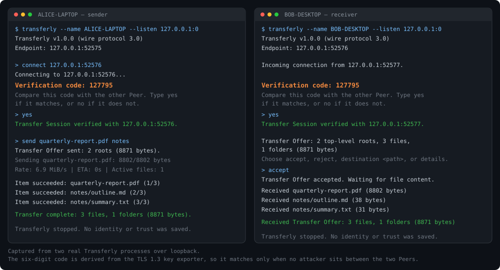

# Transferly

[](https://github.com/Het-Jethva/Transferly/actions/workflows/test.yml)
[](https://goreportcard.com/report/github.com/Het-Jethva/Transferly)
[](LICENSE)

Transferly is a foreground terminal application for direct file exchange between reachable Peers. It discovers Available Peers with mDNS/DNS-SD when multicast works, retains manual IPv4 endpoints as a fallback, opens temporary human-verified Transfer Sessions, and can safely copy explicitly approved regular files in either direction.

Transferly uses no account, cloud service, relay, configuration file, persistent identity, remembered trust, telemetry, or log file.



## How it works

Two Peers connect directly over TCP and immediately establish mutually authenticated TLS 1.3 using ed25519 credentials that are generated per connection and never written to disk. Because neither Peer has a certificate authority or any remembered identity, the handshake alone cannot prove who is on the other end.

Transferly closes that gap with a short authentication string. Both Peers derive a six-digit code from the TLS exporter (RFC 5705) over the finished handshake, so the code is a function of the session keys. A network attacker who intercepts the connection necessarily terminates two different TLS sessions and cannot make both codes agree; the humans comparing those codes out of band are what turn an encrypted channel into an authenticated one. Trust lasts exactly as long as the connection.

Content is protected separately from the channel. Every file in a Transfer Offer is listed in a manifest with its size and SHA-256 digest, the receiving Peer approves that manifest as a whole, and each file is then streamed into destination-local staging, verified against the approved digest, and only published by an atomic rename that never overwrites existing content. A file whose source changed after approval fails on its own without disturbing the files that already verified.

## Requirements

- Windows 10 or 11 x64
- Go 1.26 or newer to build from source

## Build

Build the supported Windows 10/11 x64 artifact from any Go host:

```powershell
$env:CGO_ENABLED = "0"
$env:GOOS = "windows"
$env:GOARCH = "amd64"
go build -trimpath -ldflags "-s -w -X main.buildVersion=v1.0.0" -o transferly.exe ./cmd/transferly
```

The resulting single executable is portable: it needs no installer, separate Go runtime, background service, system-tray process, or administrator privileges. `scripts/build-release.ps1` builds twice and fails if the two artifacts do not hash identically, and `scripts/verify-portable.ps1` checks the Windows x64 artifact in an isolated directory.

Published releases are currently **unsigned**, because the project has no code-signing certificate; SmartScreen will warn on first run. Every release ships a SHA-256 checksum, so verify the download before running it:

```powershell
Get-FileHash -Algorithm SHA256 transferly-windows-amd64.exe
```

The release workflow signs automatically and refuses to publish an invalid signature once `WINDOWS_SIGNING_CERTIFICATE_BASE64` and `WINDOWS_SIGNING_CERTIFICATE_PASSWORD` are configured. See [the release validation runbook](docs/release-validation.md) for signing, automated gates, and the physical two-laptop matrix. Check the executable and independently versioned wire protocol with `transferly.exe --version`. Updates are manual: replace the executable with a newer signed build. Transferly performs no update checks.

## Use

Start `transferly.exe` in a foreground terminal on both computers. Windows Firewall may ask whether to permit inbound connections; allow the executable on the network profile you intend to use. If policy blocks it, open **Windows Security → Firewall & network protection → Allow an app through firewall**, ask the device administrator to permit the signed executable on the intended profile, and retry. Transferly never requests elevation or modifies firewall policy.

Transferly requires an existing directly routed IPv4 path:

- **LAN or Ethernet:** connect both computers to the same router/switch or directly by Ethernet, confirm each has an IPv4 address, then use discovery or the printed endpoint.
- **Windows Mobile Hotspot without internet:** enable Mobile hotspot on one computer and join it from the other. Internet access is not required; use the local IPv4 endpoints.
- **User-managed VPN:** discovery may not cross the VPN, so use `connect <IPv4:port>` with the reachable VPN endpoint and ensure VPN/firewall policy permits it.

Transferly does not create a Wi-Fi Direct link and does not provide NAT traversal, port forwarding, an internet relay, or central signaling. If the Peers do not already have an IPv4 route between them, create one outside Transferly first.

Each idle Peer advertises only its dynamic endpoint and Windows computer name and prints one or more endpoints:

```text
Endpoint: 192.168.1.20:53144
```

Available Peers on the local multicast-capable network appear as a numbered list:

```text
Available Peers:
  [1] LAPTOP-NAME at 192.168.1.20:53144 (untrusted discovery label)
```

Connect by current list number or by a manually supplied endpoint:

```text
connect 1
connect 192.168.1.20:53144
```

Computer names and discovery records are untrusted availability hints; they never establish identity or remembered trust. Stale advertisements disappear, duplicate names remain distinguishable by endpoint, and a Peer withdraws its advertisement while a connection is pending or active. If mDNS is blocked or unavailable, startup and manual endpoint connection continue normally.

Both terminals display a six-digit code. Compare the codes through an in-person or otherwise trusted channel, then type `yes` on both terminals only when they match. Type `no` on either terminal if they do not match.

In a verified Transfer Session, either Peer can offer any mix of files and folders repeatedly:

```text
send C:\path\to\report.pdf "C:\path\to\Project Folder"
```

Folders are traversed recursively. Readable regular files, hidden files, zero-byte files, nested folders, and empty folders are included. Symbolic links, junctions, reparse points, and unreadable or vanished entries are omitted and disclosed. The receiving Peer sees top-level roots, file/folder counts, total bytes, omissions, the Downloads destination, and conflict-resolved final paths before choosing `accept` or `reject`; `details` prints the complete manifest. Use `destination <path>` to override the destination for that Transfer Offer only.

Accepted files are streamed into destination-local temporary storage, checked against the size and SHA-256 digest approved in the manifest, and atomically published without overwriting existing content. Relative hierarchy, last-modified timestamps, and basic hidden/read-only attributes are preserved; ownership, ACLs, alternate data streams, and other security metadata are not copied. A source that changes after approval fails. Independently verified files remain published when another file fails, and both Peers receive an exact partial-completion summary. The source is never modified.

Type `cancel` on either Peer, or press `Ctrl+C` during an active Transfer Offer, to cancel that offer without ending the verified Transfer Session. Incomplete staging is removed, completed files and queued offers remain, and the session prompt becomes available for more work. `Ctrl+C` outside an active transfer disconnects and exits.

If a process or connection stops abruptly, incomplete files are cleaned when possible and the Transfer Session ends. Destination-local `.transferly-staging` data left by a crash is detected the next time that destination is reviewed; use `cleanup-staging` at the offer prompt to remove it safely. Staging is never treated as resumable state, and reconnecting requires fresh verification and a new Transfer Offer.

Transfer Offers are serialized in session order, so later `send` commands wait in memory while one offer is being reviewed or transferred. Every offer requires a separate receiving-Peer decision, and queued offers are discarded when the Transfer Session ends. Additional connection attempts receive a busy outcome while a session is pending or active.

An inactive Transfer Session warns after 14 minutes and disconnects after 15 minutes. Type `keep-alive` to deliberately keep it open. Active transfers do not expire for idleness.

Use `disconnect` to end the temporary Transfer Session and `quit` to exit. Reconnecting always creates fresh in-memory credentials, discards in-memory queues, and requires verification again.

Use temporary command-line overrides when needed:

```text
--name TEMPORARY-NAME
--output C:\Receiving\Folder
--listen IPv4:port
```

`--name` changes the advertised computer-name hint, `--output` changes the default incoming destination, and `--listen` selects a local IPv4 bind address and port. Port `0` requests an available dynamic port, which is the default. These values apply only to that process and no configuration file is created. Run `transferly.exe --help` for the complete interactive workflow and `transferly.exe --version` for executable and wire-protocol versions.

Transferly's network activity is limited to explicit local mDNS/DNS-SD discovery and direct Peer connections requested through `connect` (plus accepted traffic on its printed listening endpoint). It makes no account, relay, telemetry, analytics, crash-reporting, or update-check connections. Operational output goes only to the terminal; no persistent log or transfer history is written.

## Test

```powershell
go test ./...
go test -race ./...
go test ./internal/session -run=^$ -fuzz=^FuzzProtocolFrameLengthHandling$ -fuzztime=30s
go test ./internal/terminal -run=^$ -fuzz=^FuzzManifestPathConfinement$ -fuzztime=30s
go test ./internal/session -run=^$ -bench=^BenchmarkThroughput$ -benchtime=3x -benchmem
golangci-lint run ./...
```

The integration suite builds and launches real Transferly processes over loopback and interacts with their public terminal interface. CI also runs the targeted verification-code, conflict-name, and manifest-limit fuzz smoke tests, the race detector, benchmarks, and reproducible portable-package checks. Complete commands and expected evidence are in [the release validation runbook](docs/release-validation.md).

Because the suite drives separate executables, an ordinary `-coverprofile` run reports no statements for it and makes the project look far less tested than it is. Build the Peers with coverage instrumentation instead and merge the per-process profiles:

```powershell
$env:TRANSFERLY_COVERDIR = "$PWD/covdata"
go test ./... -coverpkg=./internal/...,./cmd/...
go tool covdata percent -i=covdata
```

Measured that way, the behavior driven through the public terminal interface covers 77% of `internal/terminal`, 73% of `internal/session`, and 41% of `cmd/transferly`. `internal/discovery` is exercised by its own unit tests and by the opt-in mDNS check below, since multicast discovery does not run on a loopback-only machine.

Behavior that cannot be reached through the public terminal interface -- a corrupted digest on the wire, a deliberately slowed stream, a controllable session clock -- lives behind the `transferly_faults` build tag and is compiled out of every release artifact. `scripts/build-release.ps1` fails the build if fault code is present in the published executable. Run the injectable variant with:

```powershell
go build -tags transferly_faults ./...
```

On a multicast-capable local network, opt into the two-process real mDNS check:

```powershell
$env:TRANSFERLY_TEST_MDNS = "1"
go test ./integration -run TestRealMDNSDiscoveryConnectsByAvailablePeerNumber
```
